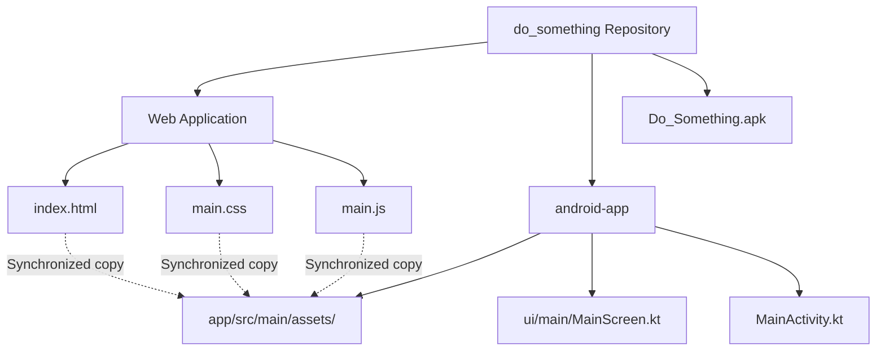

# 🚀 Do_Something

[](https://github.com/as-repo1/do_something/releases)
[](https://github.com/as-repo1/do_something/actions)
[](https://developer.android.com/)
[](https://opensource.org/licenses/MIT)
[](https://github.com/as-repo1/do_something)

A beautiful, premium, and feature-rich offline personal task manager. It runs as a responsive single-page web app and has a native Android app wrapper built with Jetpack Compose.

Features a modern glassmorphic layout, adaptive custom themes, and full offline data portability.

---

## 📸 Interface Preview & Design Aesthetics
* **Glassmorphism Design**: Frosted borders, fine drop shadows, and modern typography (`Outfit` and `Fira Code` imported from Google Fonts).
* **Multi-Theme Engine**: Swappable color schemes that instantly adapt to your aesthetic:
  * 🌌 **Nord**: Sleek Arctic frost and deep charcoal.
  * 🪵 **Gruvbox**: Retro sand accents and soft brown.
  * 🧛 **Dracula**: Neon pink highlights with dark purple base.
  * ☀️ **Light Mode**: High-contrast, clean slate styling.
* **SVG Analytics Dashboard**: Dynamic progress statistics accompanied by a fluid, reactive circular SVG progress indicator.

---

## ✨ Features

- 📂 **Full Category Management**: Organize tasks dynamically under labels like `Work`, `Ideas`, `Health`, or custom tags.
- ⚡ **Task Sorting & Live Filters**:
  * Search instantly by description or category.
  * Filter list dynamically by status (All, Active, Completed), Priority, or Category.
  * Sort by Creation Date, Due Date, Priority level, or Alphabetical title.
- 📆 **Overdue Detection & Priority Indicators**:
  * Flag tasks as Low, Medium, or High priority.
  * Set due dates; overdue tasks automatically display visual warnings.
- ✏️ **Inline Text Editing**: Double-click any task to edit its title inline. Press `Enter` to save, or `Escape` to cancel.
- 🔄 **Data Migration & Portability**: Export your entire task store as a formatted JSON schema, and import backups securely with strict schema validation.
- 📱 **Edge-to-Edge Android App**:
  * Runs fully offline using DOM local storage.
  * Leverages a native file selection launcher to support JSON backups directly within the WebView.
  * Configured to preserve layout sizing against system accessibility text zoom settings.
  * Prevents reload resets on device orientation changes.

---

## 🛠️ Repository Architecture

The project maintains a unified layout for web assets and the native Android wrapper:



* **`/index.html`, `/main.css`, `/main.js`**: Core offline web application.
* **`/android-app`**: Native Android Gradle project using Jetpack Compose and WebView.
* **`/Do_Something.apk`**: Local compiled APK for direct, offline sideloading (git-ignored to protect repository size).
* **`/.github/workflows/release.yml`**: GitHub Actions tag-release automation.

---

## 🚀 How to Run Locally

### 1. Web Version
Since it utilizes vanilla web technologies, you can open it directly:
* Double-click `index.html` to run.
* **Alternative (via Node.js)**:
  ```sh
  npx -y serve -l 3100 ./
  ```
  Then open `http://localhost:3100`

### 2. Android Version (Locally)
If you want to compile the APK yourself, ensure you have the Android SDK setup and run:
```sh
cd android-app
chmod +x gradlew
./gradlew assembleDebug
```
The compiled APK will be output to:
`android-app/app/build/outputs/apk/debug/app-debug.apk`

---

## 📦 GitHub Release Automation & Sideloading

### Sideloading the Local APK
We have provided a compiled **`Do_Something.apk`** in the root directory of this project for convenience. You can copy it to your phone and install it directly. Note that this file is configured in `.gitignore` so it will not bloat the GitHub repository history.

### Automatic Releases via GitHub Actions
We've set up a fully automated release pipeline in `.github/workflows/release.yml`. Whenever you release a new version:
1. Push a release tag starting with `v` (e.g. `git tag v1.0.0` followed by `git push origin v1.0.0`).
2. GitHub Actions will trigger, spin up a secure Java 17 container, check out the code, and compile the Android project.
3. The pipeline will automatically create a draft or release on GitHub and attach the compiled `app-debug.apk` directly to the release page.

---

## 🔒 Security & Optimization Guidelines
* **No Secret Commits**: Gradle settings like `local.properties` and local directories (e.g. `.gradle/`, `/build`) are strictly ignored.
* **Offline Independence**: The application doesn't call external backend APIs; all data is retained on the user's client device.
* **Link Control**: The Android App intercepts external link navigation. If a task contains web links, clicking them opens the phone's native browser to protect the WebView sandbox context.

---

## 🤝 Contributing
Contributions are always welcome! Feel free to open issues, submit pull requests, or suggest new themes.

Give this repository a ⭐️ if you love the design!
